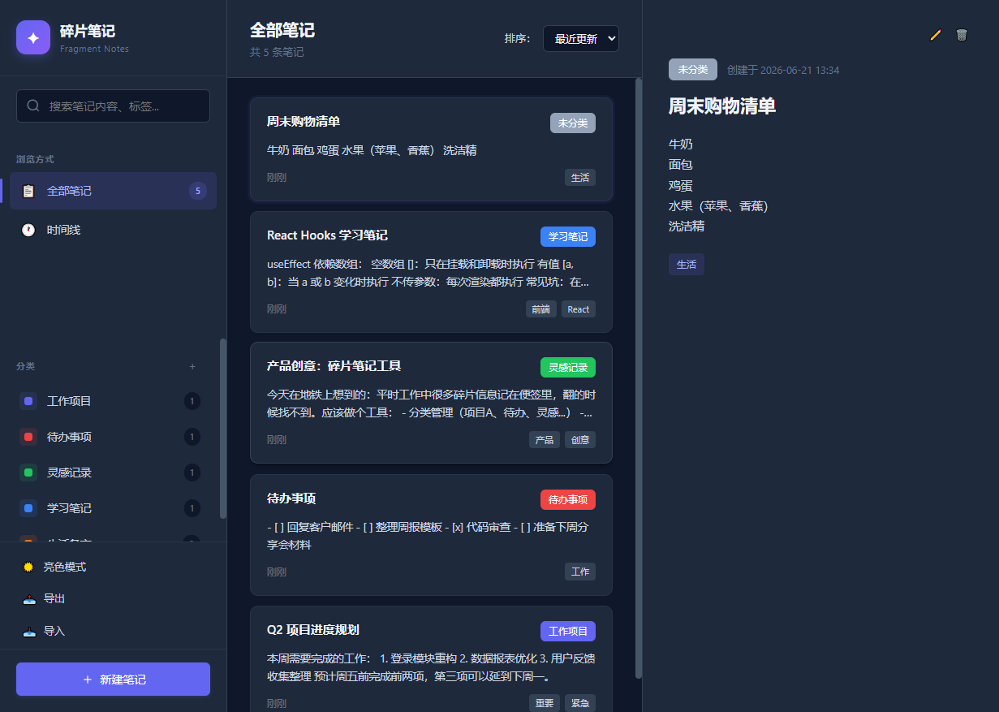

# 碎片笔记 · Fragment Notes

> 轻量级本地笔记工具，专注碎片信息的分类、搜索与管理。



## 项目简介

一个纯前端实现的碎片化信息记录工具，无需后端，数据存储在浏览器本地。适合记录：
- 工作项目中的零散任务和备注
- 日常待办事项清单
- 随时涌现的产品灵感和想法
- 学习过程中的知识点摘抄

## 安装运行

**零依赖，开箱即用。**

直接用浏览器打开 `index.html` 即可使用，无需本地 server，无需安装任何东西。

> 如果遇到跨域问题（比如 file:// 协议下某些浏览器限制），可以用任意静态服务器启动：
> ```bash
> # Python 3
> python -m http.server 8000
> # 然后访问 http://localhost:8000
> ```

## 功能说明

| 功能 | 说明 |
|------|------|
| 📝 **笔记管理** | 新建 / 编辑 / 删除笔记，支持标题、内容、分类、标签 |
| 🗂️ **分类管理** | 自定义分类名称和颜色，右键分类可编辑 / 删除 |
| 🔍 **全文搜索** | 支持标题、内容、标签多字段搜索，关键词高亮显示，正则特殊字符自动转义 |
| ⏱️ **两种视图** | 列表视图 / 时间线视图自由切换 |
| ↕️ **灵活排序** | 按更新时间、创建时间、标题排序 |
| 🌙 **暗色模式** | 侧边栏底部一键切换，选择自动记忆 |
| 📤📥 **数据导入导出** | 一键导出 JSON 备份文件，支持导入覆盖，特殊字符无损处理 |

## 技术栈

- **HTML5**：页面结构和语义化
- **CSS3**：CSS 变量主题切换，Flex / Grid 布局
- **原生 JavaScript（ES6+）**：IIFE 模块化，无任何框架和第三方依赖
- **LocalStorage**：浏览器本地持久化存储

## 项目结构

```
.
├── index.html              # 主页面
├── test.html               # 单元测试页面（53 个用例）
├── screenshot.png          # README 截图
├── README.md
└── assets/
    ├── css/
    │   └── style.css       # 所有样式（含暗色模式主题变量）
    └── js/
        ├── storage.js      # 数据层：笔记/分类 CRUD、localStorage 读写、导入导出
        ├── categories.js   # 分类逻辑：分类渲染、弹窗、颜色选择、getCategoryName/Color
        ├── search.js       # 搜索逻辑：关键词搜索、模糊搜索排序、高亮、escapeRegExp/Html
        ├── notes.js        # 笔记渲染：列表视图、详情面板、笔记弹窗表单
        ├── timeline.js     # 时间线视图渲染
        └── app.js          # 主入口：状态管理、事件绑定、各模块协调、主题切换、导入导出 UI
```

## 数据说明

所有数据存储在浏览器 `localStorage` 中，不向任何服务器发送。

### Key 列表

| Key | 说明 |
|-----|------|
| `fragment_notes` | 笔记数组 |
| `fragment_categories` | 分类数组 |
| `theme` | 主题设置（`light` / `dark`） |

### 数据格式

**Note（笔记）**
```json
{
  "id": "唯一ID",
  "title": "笔记标题",
  "content": "笔记内容（支持换行等特殊字符）",
  "categoryId": "分类ID 或 null（未分类）",
  "tags": ["标签1", "标签2"],
  "createdAt": 1718947200000,
  "updatedAt": 1718947200000
}
```

**Category（分类）**
```json
{
  "id": "唯一ID",
  "name": "分类名称",
  "color": "#6366f1",
  "createdAt": 1718947200000
}
```

### 默认分类

首次使用自动创建 5 个分类：工作项目、待办事项、灵感记录、学习笔记、生活备忘。可随时删除或修改。
